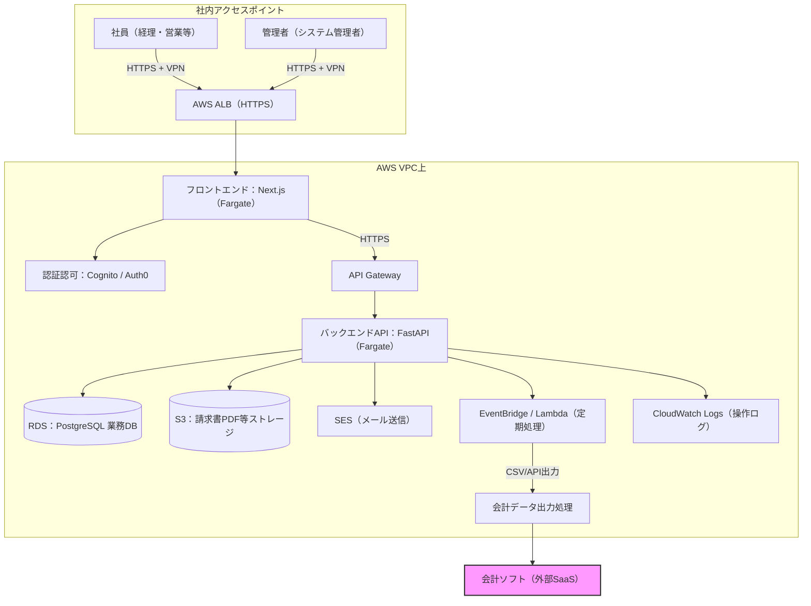

# 06_システム構成図

以下は現時点で整理されたアーキテクチャの構成図です。

## 🔷 全体構成（Mermaid図）

```mermaid
graph TD

  %% 社内ユーザー
  subgraph 社内アクセスポイント
    U1[社員（経理・営業等）]
    U2[管理者（システム管理者）]
    U1 -->|HTTPS + VPN| ALB[AWS ALB（HTTPS）]
    U2 -->|HTTPS + VPN| ALB
  end

  %% AWSインフラ
  subgraph AWS VPC上
    ALB --> FE[フロントエンド：Next.js（Fargate）]
    FE --> Auth[認証認可：Cognito / Auth0]
    FE -->|HTTPS| API_GW[API Gateway]

    API_GW --> BE[バックエンドAPI：FastAPI（Fargate）]
    BE --> DB[(RDS：PostgreSQL 業務DB)]
    BE --> S3[(S3：請求書PDF等ストレージ)]
    BE --> Mail[SES（メール送信）]
    BE --> Scheduler[EventBridge / Lambda（定期処理）]
    BE --> Log[CloudWatch Logs（操作ログ）]

    Scheduler -->|CSV/API出力| AccountingExport[会計データ出力処理]
  end

  %% 会計ソフト（外部）
  AccountingExport --> AccountingSaaS[会計ソフト（外部SaaS）]
  AccountingSaaS:::external

  %% 装飾
  classDef external fill:#f9f,stroke:#333,stroke-width:2px

``` 