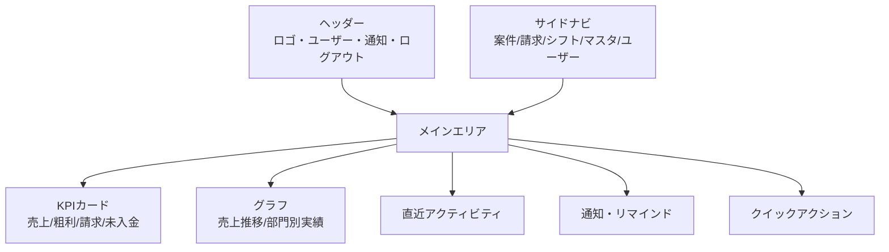
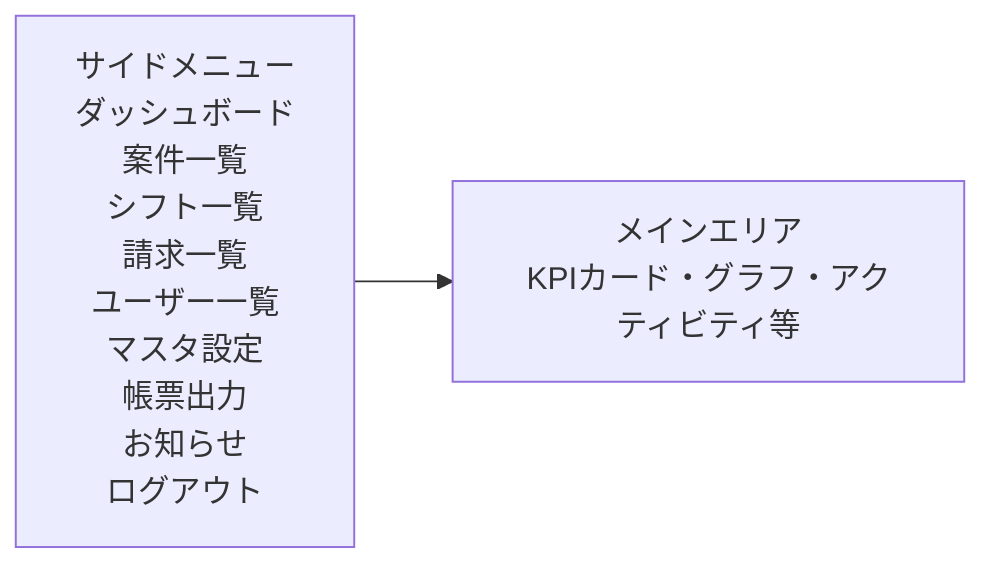

# ダッシュボード画面設計（SaaS品質）

## 1. 画面コンセプト
- シンプルかつ直感的な操作性
- 主要KPIやアクションを一目で把握できる
- レスポンシブ対応（PC・タブレットで美しく表示）
- SaaSらしい洗練された配色・余白・アイコン活用

---

## 2. 機能・要素一覧

- ヘッダー（ロゴ、ユーザーアイコン、通知、ログアウト）
- サイドナビゲーション（案件一覧、請求一覧、シフト一覧、マスタ管理、ユーザー管理 など）
- メインエリア
    - KPIカード（売上、粗利、請求件数、未入金件数 など）
    - グラフ（売上推移、部門別実績、インセンティブ分布 など）
    - 直近のアクティビティ（最新の案件・請求・入金状況）
    - 通知・リマインド
    - クイックアクション（新規案件登録、請求書発行 など）

---

## 3. ワイヤーフレーム（Mermaid記法）



---

## 4. UIデザイン指針

- カラースキーム：  
  - メイン：ホワイトベース＋アクセントカラー（ブルー系推奨）  
  - KPIカード：淡色背景＋アイコン＋大きな数値表示  
  - グラフ：シンプルな棒グラフ・折れ線グラフ（Chart.jsやRecharts等を想定）

- フォント：  
  - サンセリフ系（Noto Sans, Roboto, Open Sans など）

- アイコン：  
  - Material Icons, FontAwesome等を活用

- レイアウト：  
  - 余白をしっかり取り、情報密度をコントロール  
  - PC/タブレットでのレスポンシブ対応 

---

## サイドメニュー構成（左側固定）

- **ダッシュボード**
- **案件一覧**
- **シフト一覧**
- **請求一覧**
- **ユーザー一覧**
- **マスタ設定**
  - 案件種別マスタ
  - 取引先マスタ
  - 店舗マスタ
  - 報酬マスタ
- **帳票出力**
- **お知らせ**
- **ログアウト**

---

## レイアウトイメージ（テキスト）

```
┌─────────────────────────────┬──────────────────────────────┐
│        サイドメニュー       │         メインコンテンツ      │
│ ───────────────────────── │ ─────────────────────────── │
│  [ダッシュボード]          │   [KPIカード][グラフ]         │
│  [案件一覧]                │   [直近アクティビティ]         │
│  [シフト一覧]              │   [通知・リマインド]           │
│  [請求一覧]                │   [クイックアクション]         │
│  [ユーザー一覧]            │                              │
│  [マスタ設定]▼             │                              │
│    ├─案件種別マスタ         │                              │
│    ├─取引先マスタ           │                              │
│    ├─店舗マスタ             │                              │
│    └─報酬マスタ             │                              │
│  [帳票出力]                │                              │
│  [お知らせ]                │                              │
│  [ログアウト]              │                              │
└─────────────────────────────┴──────────────────────────────┘
```

---

## Mermaidワイヤーフレーム（サイドメニュー強調）

